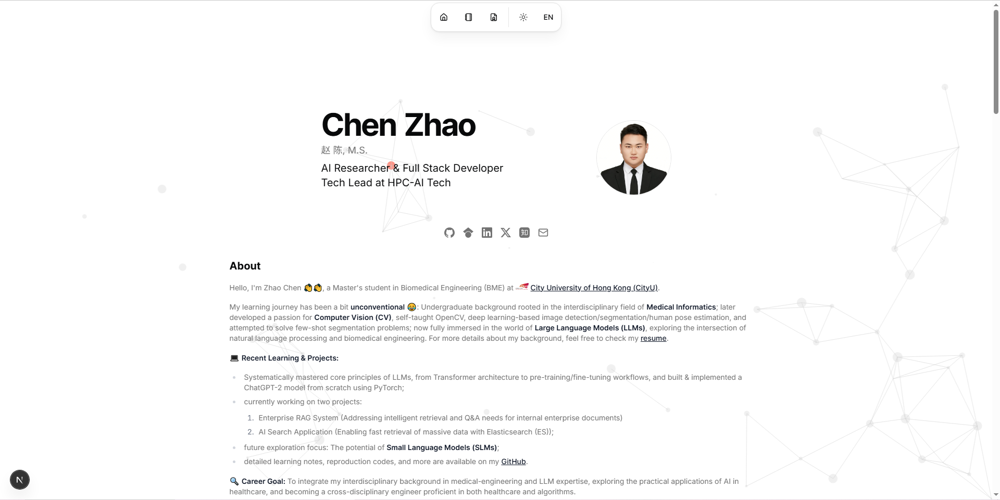

# 赵陈的个人主页

这是我的个人主页源码仓库，用于展示项目实践、实习与工作经历、教育背景、研究成果，以及围绕 AI 与软件开发的学习笔记。

[](https://www.czhao.xyz/)

## 在线访问

- 个人主页：[www.czhao.xyz](https://www.czhao.xyz/)
- GitHub：[chenzhao-labs](https://github.com/chenzhao-labs)


## 网站功能

- 中英文双语与深色模式
- 项目、教育经历、实习与工作经历、奖项等个人履历展示
- 基于 MDX 的技术博客
- 响应式布局，适配桌面与移动端
- SEO、Open Graph、JSON-LD、站点地图与 robots.txt
- Vercel Analytics 与 Speed Insights 支持

## 技术栈

- [Next.js 16](https://nextjs.org/) 与 React 19
- TypeScript
- [Tailwind CSS 4](https://tailwindcss.com/)
- [next-intl](https://next-intl.dev/) 国际化
- [Motion](https://motion.dev/) 动画
- [shadcn/ui](https://ui.shadcn.com/) 与 Radix UI 组件
- MDX、React Markdown、Shiki 与 KaTeX
- [Vercel](https://vercel.com/) 部署、Analytics 与 Speed Insights

## 本地运行

推荐使用 Node.js 18.18 至 22，以及 pnpm。

```bash
git clone git@github.com:chenzhao-labs/nextjs-personal-portfolio.git
cd nextjs-personal-portfolio
pnpm install
pnpm dev
```

启动后访问 [http://localhost:3000](http://localhost:3000)。

常用命令：

```bash
pnpm lint
pnpm build
pnpm start
```

## 内容维护

| 内容 | 位置 |
| --- | --- |
| 站点配置与头像 | `src/data/site.ts`、`public/` |
| 中文个人资料 | `src/i18n/messages/zh/personal.json` |
| 英文个人资料 | `src/i18n/messages/en/personal.json` |
| 中英文项目、经历、教育与奖项 | `src/i18n/messages/*/collections.json` |
| 博客文章 | `content/blog/zh/`、`content/blog/en/` |
| 项目封面与机构图标 | `public/proj/`、`public/icon/` |

## 部署

仓库连接至 Vercel 后，推送到 GitHub 会自动触发构建和部署。部署完成后，页脚日期会同步显示该次构建日期。
