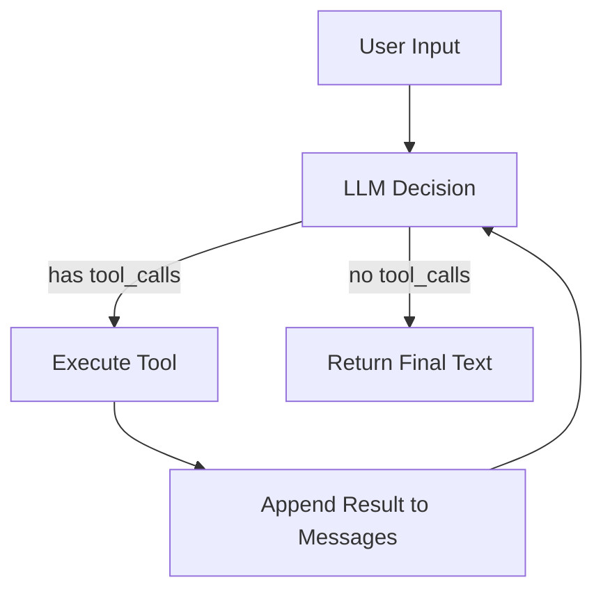

By 2026, the term "AI Agent" has been hyped beyond recognition by every framework out there. LangChain, AutoGen, CrewAI, Microsoft Agent Framework... each with its own set of abstractions, each promising that "just a few lines of code can build a powerful Agent."

But I kept coming back to one question: **strip away all the frameworks — what is an Agent, really?**

So I did one thing: with nothing more than `pip install openai`, I built a working AI Agent from scratch. This post captures that exploration and the core insight at the end of it.

---

📦 **Links**

- Project repo: [Building Agent from Scratch](https://github.com/chenzhao-labs/Building_Agent_from_scratch)
- Original course: [microsoft/ai-agents-for-beginners](https://github.com/microsoft/ai-agents-for-beginners)
- Model API: [Alibaba Cloud Bailian DashScope](https://bailian.console.aliyun.com/)

---

## 🎯 Starting with the Right Question: What Counts as an Agent?

Before writing any code, let's get the definition straight. There are many takes on what an Agent is, but at the most fundamental level:

> **AI Agent = LLM + Tools + Environment. It's not a single model — it's a system.**

Breaking it down:

- **LLM** — the brain. Responsible for understanding instructions, reasoning, and decision-making.
- **Tools** — the hands and feet. They let the LLM *do things* rather than just *say things*.
- **Environment** — the workspace. External systems the tools can access (APIs, databases, files, etc.).

The core difference between a real Agent and a regular LLM application: **the LLM autonomously decides when to call a tool, which tool to call, and what parameters to pass**. This capability is technically called **Tool Calling** (also known as Function Calling), and it's the single reason every Agent framework exists.

Example: a user says "Recommend a warm beach destination." A plain LLM answers from training data — possibly stale. An Agent first calls `get_destinations()` to get real data, then makes a recommendation based on that data.

---

## 🛠️ Tech Choices: Why No Framework

Microsoft's AI Agents for Beginners course uses the Microsoft Agent Framework (MAF). The core code looks like this:

```python
provider = AzureAIProjectAgentProvider(credential=AzureCliCredential())

@tool(approval_mode="never_require")
def check_availability(destination: str) -> str: ...

agent = await provider.create_agent(
    name="TravelAgent",
    instructions="You are a travel agent...",
    tools=[check_availability],
)
response = await agent.run("Which destinations are available?")
```

Clean, yes. But the questions pile up fast:

- What happens inside `provider.create_agent()`?
- Why does `agent.run()` automatically call `check_availability`?
- If `check_availability` throws an error, how does the agent know?
- In multi-turn conversation, how does the agent remember what was said earlier?

Without answers to these, switching frameworks just means switching syntax sugar.

Here's the approach I chose:

| Component | Choice | Why |
|------|------|------|
| Model API | Qwen DashScope | Accessible, free quota, OpenAI SDK-compatible |
| Transport | `openai` SDK | Minimal dependency, the compatibility layer for all modern LLM APIs |
| Agent Framework | **None** | Hand-write the internals first; use qwen-agent only on the second pass |

---

## 🔬 The Core Discovery: An Agent Is a 30-Line `while` Loop

After writing the first version, I realized the internals of every Agent framework can be reduced to this:

```python
def run_agent(system_prompt: str, user_message: str) -> str:
    messages = [
        {"role": "system", "content": system_prompt},
        {"role": "user", "content": user_message},
    ]

    while True:
        response = client.chat.completions.create(
            model=MODEL, messages=messages, tools=TOOLS_SCHEMA
        )
        msg = response.choices[0].message

        # No tool_calls → LLM delivered final answer, loop ends
        if not msg.tool_calls:
            return msg.content

        # Tool calls present → execute tools → append results → continue
        messages.append(_assistant_message(msg))
        for tc in msg.tool_calls:
            func = TOOL_MAP.get(tc.function.name)
            result = func()
            messages.append({
                "role": "tool",
                "tool_call_id": tc.id,
                "content": json.dumps(result, ensure_ascii=False),
            })
```

**That's it. 30 lines. No magic.**

What this loop does is essentially a "perceive-decide-act" cycle from reinforcement learning:



Once you understand three things, every Agent framework becomes transparent:

1. **Tool Schema** — a JSON Schema that tells the LLM "here are my tools and their parameters". The LLM uses this to decide what to call and with which arguments.
2. **Tool Calling Loop** — the `while True` above. As long as the LLM doesn't return final text, keep calling tools.
3. **Messages List** — conversation context. Tool results get appended to the same list, and that *is* the LLM's "memory".

---

## 📝 Code Walkthrough: Four Steps from Zero

### Step 1: Connect to the Model

```python
from openai import OpenAI

client = OpenAI(
    api_key=os.getenv("DASHSCOPE_API_KEY"),
    base_url="https://dashscope.aliyuncs.com/compatible-mode/v1",
)
MODEL = "qwen-flash"
```

Qwen's DashScope provides an OpenAI-compatible endpoint, so we can use the `openai` SDK directly. This is what makes the project runnable with zero Azure dependency.

### Step 2: Define a Tool

```python
def get_destinations() -> list[str]:
    """Get popular vacation destinations."""
    return ["Barcelona", "Paris", "Berlin", "Tokyo",
            "Sydney", "New York", "Cairo", "Cape Town",
            "Rio de Janeiro", "Bali"]

TOOLS_SCHEMA = [{
    "type": "function",
    "function": {
        "name": "get_destinations",
        "description": "Get a list of popular vacation destinations",
        "parameters": {"type": "object", "properties": {}},
    },
}]

TOOL_MAP = {"get_destinations": get_destinations}
```

Every tool has three parts:
- **Implementation** (Python) — the actual logic that executes
- **Schema** (JSON) — tells the LLM its name, purpose, and parameters
- **Name mapping** (dict) — maps the function name the LLM returns to the callable Python function

### Step 3: Write the Agent Loop

That's the `while True` block above. Nothing more to explain.

### Step 4: Add Streaming Output

In real chat scenarios, users don't want to wait for the entire response. Use an additional streaming request for word-by-word output:

```python
# After tool_calls complete, re-request final response with stream=True
stream = client.chat.completions.create(
    model=MODEL, messages=messages, stream=True,
)
for chunk in stream:
    delta = chunk.choices[0].delta
    if delta.content:
        print(delta.content, end="", flush=True)
```

This isn't a framework feature — it's provided by the API itself. Once you know this, you stop treating it as "framework magic".

---

## 🔄 Comparison: What the Framework Actually Saves You

After the raw version, I rewrote it using [qwen-agent](https://github.com/QwenLM/Qwen-Agent). Here's the side-by-side:

```python
# ── Raw: define tools with JSON Schema ──
TOOLS_SCHEMA = [{"type": "function", "function": {...}}]

# ── Framework: decorator auto-generates Schema ──
@register_tool("get_destinations")
class GetDestinations(BaseTool):
    description = "Get popular vacation destinations"
    parameters = []
    def call(self, params, **kwargs): ...

# ── Raw: hand-write the while True loop ──
while True:
    response = client.chat.completions.create(...)
    if not msg.tool_calls: return msg.content
    for tc in msg.tool_calls: ...

# ── Framework: one run() call handles it all ──
for responses in agent.run(messages=[{"role": "user", "content": "..."}]):
    print(responses[-1]["content"])
```

The framework does three things for you:

| What the Framework Does | Corresponding Raw Code |
|------------------------|------------------------|
| Schema auto-generation | Hand-write `TOOLS_SCHEMA` dict |
| Tool Calling loop | Hand-write `while True` |
| Multi-turn message management | Manually `messages.append(...)` |

After writing both versions, one key insight crystallized: **frameworks are not black magic — they just wrap what you can already write by hand. Once you understand the internals, a framework becomes a productivity tool rather than a "system" you have to believe in.**

---

## 🚀 Get It Running

```bash
# 1. Get an API Key
#    👉 https://bailian.console.aliyun.com/
#    Enable DashScope, get a sk-xxx key (free quota for new users)

# 2. Install dependencies
pip install openai python-dotenv

# 3. Set environment variable
export DASHSCOPE_API_KEY=sk-your-api-key

# 4. Run
python 01-python-agent-framework.py
```

You'll see the LLM automatically call `get_destinations`, retrieve the real destination list, and make a recommendation based on it. No Agent framework required.

---

## 💡 Four Key Takeaways

Completing this exercise fundamentally shifted how I think about Agents:

**1. Agent capability is not granted by a framework**

LLM APIs natively support tool calling. As long as your request includes the `tools` parameter, the LLM can return `tool_calls`. Agent frameworks just manage the loop — they don't *provide* the "Agent capability" itself.

**2. Tool Schema is the LLM's "eyes"**

The LLM has no idea what tools you have unless you tell it. JSON Schema is the "contract" between you and the model — you declare what your tools can do, and the model makes decisions within those boundaries. How well you write the Schema directly determines how intelligent your Agent is.

**3. The Messages list IS memory**

Short-term "memory" has zero magic — it's just continuously appending messages to the same list: `[system, user, assistant, tool, assistant, ...]`. A framework's session object is exactly this underneath.

**4. Raw first, framework second — it's faster to learn**

Learning a framework directly leaves you wondering "why does `agent.run()` automatically call tools?". Write it once by hand, and you'll never be led around by framework APIs again — you'll derive usage from principles.

---

## 🔮 What's Next

This is the first post in a series. Coming up:

- **Multi-tool Composition** — when an Agent holds query, search, and booking tools simultaneously, how does the LLM orchestrate the call order?
- **Multi-Agent Collaboration** — when you split tasks across multiple Agents, how do you design communication and responsibility boundaries?
- **RAG Integration** — how to turn an external knowledge base into a "tool" the Agent can call?
- **Productionization** — observability, evaluation, and cost management.

All code and posts will be updated in the [Building Agent from Scratch](https://github.com/chenzhao-labs/Building_Agent_from_scratch) repo.

---

## ✍️ Closing

An AI Agent is not a concept exclusive to any framework — it's the combination of an LLM, tools, and a control flow loop. Once you've built one by hand in 30 lines, your understanding will be deeper than reading ten framework docs cover to cover.

**Understand first, then use tools. Not the other way around.**

Star ⭐ the repo, and feel free to open an Issue to discuss your understanding and questions.
