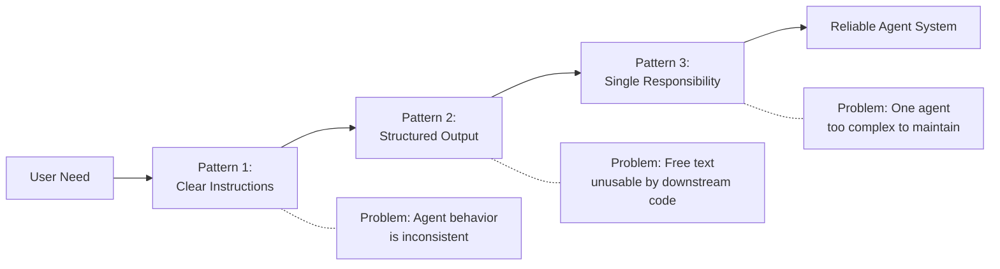
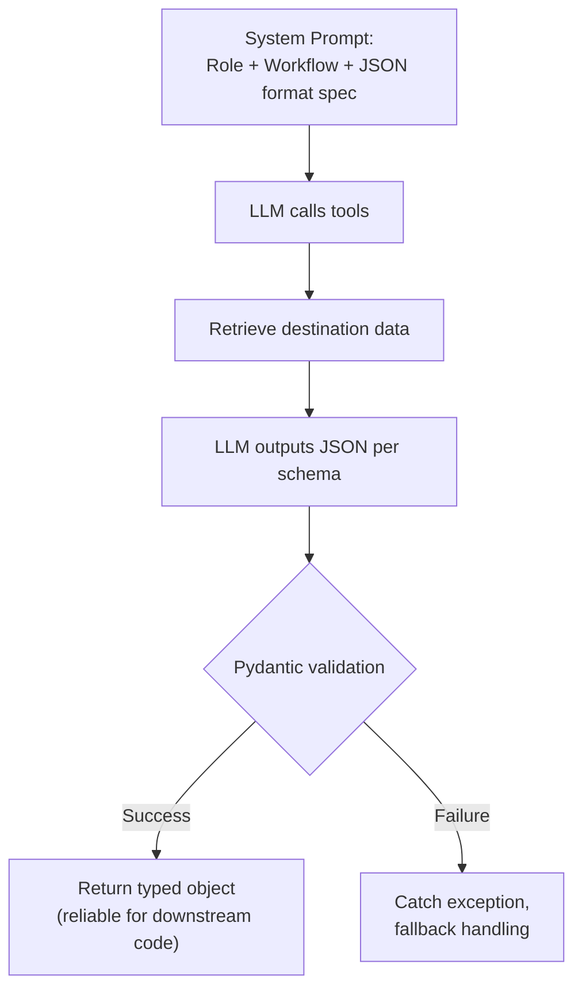
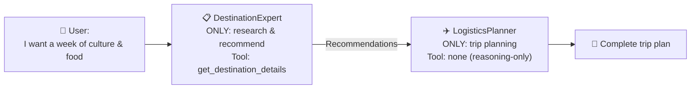
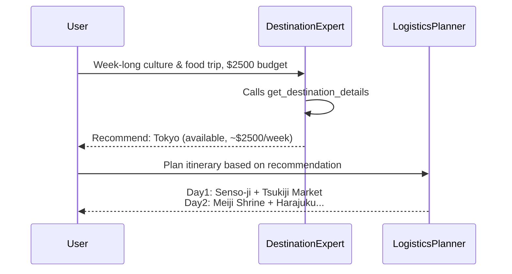
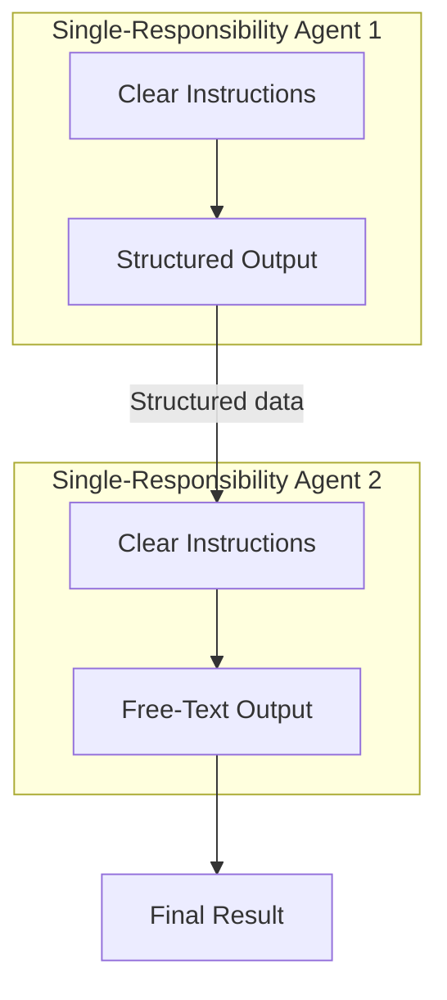

The last two posts covered what an Agent is (the tool calling loop) and the four-layer abstraction of frameworks (Client → Agent → Tools → Session). Those are the "it works" foundation.

But the gap between "it works" and "it works well" is design.

This post covers three foundational Agentic design patterns. Each solves a concrete problem, with code comparisons — raw SDK on one side, qwen-agent on the other.

---

📦 **Links**

- Project repo: [Building Agent from Scratch](https://github.com/chenzhao-labs/Building_Agent_from_scratch)
- Lesson code: [03-agentic-design-patterns/code_samples/](https://github.com/chenzhao-labs/Building_Agent_from_scratch/tree/main/03-agentic-design-patterns/code_samples)

---

## 🎯 What Problem Does Each Pattern Solve



---

## Pattern 1: Clear Agent Instructions

### The Problem

The most common mistake when writing Agent instructions:

> "You are a helpful travel assistant. Help users plan their trips."

This is too vague. The LLM improvises — sometimes eagerly calling tools, sometimes fabricating answers from training data. Behavior varies across runs.

### The Solution: Three Elements of Good Instructions

A good system prompt must define three things:

| Element | Answers | Example |
|---------|---------|---------|
| **Role** | Who am I? | "You are a luxury travel concierge named Alex" |
| **Workflow** | What steps do I follow? | "Query 2-3 destinations → filter → recommend" |
| **Constraints** | What must I NOT do? | "Never fabricate — always base answers on tool data" |

### Key Technique: Show, Don't Tell

For smaller models like `qwen-flash`, concrete workflow demonstrations beat abstract role descriptions:

**❌ Vague instruction:**

> "Recommend destinations based on user preferences. Use tools to look up information."

**✅ Instruction with demonstration:**

> ```
> Recommendation workflow:
> Step 1: query get_destination_details("Paris")
> Step 2: query get_destination_details("Tokyo")
> Step 3: query get_destination_details("Barcelona")
> Step 4: filter and recommend based on results
>
> If a destination is unavailable (returns "no info"), you must query another.
> ```

This is Few-Shot Prompting applied to tool use — instead of explaining principles, show the model "what a good run looks like."

### Engineering Practice

In raw SDK, the instruction is a carefully constructed string passed as `system` role. In qwen-agent, the same content goes into `Assistant(system_message=...)`. Same instruction, different delivery mechanism.

### How to Evaluate Your Instructions

Run the same query three times. Observe:

- Does the Agent always call the tool before answering? (Not fabricating)
- On an unavailable destination, does it automatically try the next? (Not giving up)
- Is the tone and style consistent? (Not oscillating between formal and casual)

---

## Pattern 2: Structured Output

### The Problem

Free text is great for humans, terrible for code. If downstream systems need to consume Agent output (auto-booking, report generation, workflow triggering), free text is a nightmare — you end up writing regex, doing NER, handling edge cases.

### The Solution: Pydantic + JSON Constraints

Define the output schema with Pydantic models:

> **DestinationRecommendation**
> - `destination`: str — destination name
> - `available`: bool — whether available
> - `best_season`: str — best travel season
> - `highlights`: list[str] — list of highlights
> - `estimated_budget_usd`: int — budget estimate in USD

> **TravelRecommendations**
> - `recommendations`: list[DestinationRecommendation] — recommendation list
> - `personalized_note`: str — personalized note

Then specify the output format in the system prompt:

> Your final response must be strict JSON. Format example: `{"recommendations": [{"destination": "...", "available": true, "best_season": "...", "highlights": ["..."], "estimated_budget_usd": 2200}], "personalized_note": "..."}`

### The Full Flow



Key design decisions:

- **Specify format in the prompt**, not via a framework `response_format` parameter. This gives you fine-grained control and makes the approach portable across frameworks.
- **Pydantic as the last line of defense**. LLMs occasionally produce format deviations (extra comma, missing quote). `model_validate_json()` catches them immediately, and you can fallback in the catch block.

### Why Not Use Framework-level response_format

qwen-agent's `Assistant` doesn't have a `response_format` parameter. MAF and LangChain do, but each framework's API differs. Putting format requirements in the prompt makes your code framework-agnostic — switch frameworks, keep the prompt.

---

## Pattern 3: Single-Responsibility Agents

### The Problem

One Agent doing everything → prompt gets longer → behavior gets less controllable → debugging gets harder.

This is the "God Object" anti-pattern, applied to Agents.

### The Solution

Split complex tasks across focused Agents, each responsible for exactly one thing:



The splitting principle is separation of concerns — not by functional module, but **by responsibility boundary**:

| Agent | Responsibility | Tools | Explicitly told NOT to discuss |
|-------|---------------|-------|-------------------------------|
| DestinationExpert | Research and recommend | get_destination_details | Flights, hotels, logistics |
| LogisticsPlanner | Itinerary and planning | None | Destination raw data |

Each Agent's system prompt explicitly says "do NOT discuss X — that's handled by another agent." This isn't fluff — it prevents boundary violations. LLMs have a natural tendency to "say more," and must be constrained with negation.

### Orchestration Pattern



In raw SDK, orchestration is just sequential Python function calls. In qwen-agent, it's the same — **Python itself is the orchestration layer. You don't need WorkflowBuilder.**

---

## 💡 How the Three Patterns Compose

The patterns aren't mutually exclusive — they stack:



- Agent 1 (DestinationExpert): clear instructions + structured output
- Agent 2 (LogisticsPlanner): clear instructions + free-text output
- Both connected by Python function calls, with Agent 1's output feeding into Agent 2

This is the most common composition in real projects: data-producing Agents use structured output, text-producing Agents use free text.

---

## 🚀 Try It

```bash
cd 03-agentic-design-patterns/code_samples

# Raw version
python 03-python-agent-framework.py

# Framework version
python 03-qwen-agent-framework.py
```

---

## 🔮 Next Up

With "how to design one Agent" and "how to design multiple Agents" covered, the next post tackles the heart of tool use — **multi-tool composition and tool approval patterns**: how does the LLM orchestrate call order with 3+ tools? How to add human approval for side-effect operations (booking, charging)?

---

## ✍️ Closing

The three patterns in one line each:

- **Instructions**: don't give the model room to improvise — give it a step-by-step demonstration
- **Output**: don't make downstream code guess the format — use Schema as a contract
- **Responsibility**: don't let one Agent do everything — split by boundaries

Frameworks determine how fast you can write your first Agent. Design patterns determine how long your Agent can run in production.
