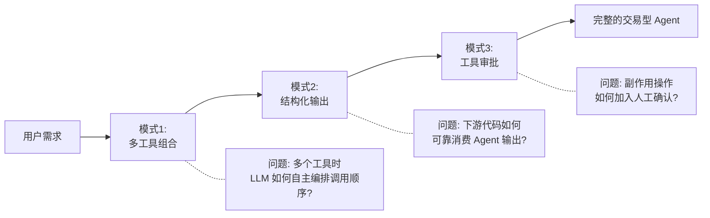
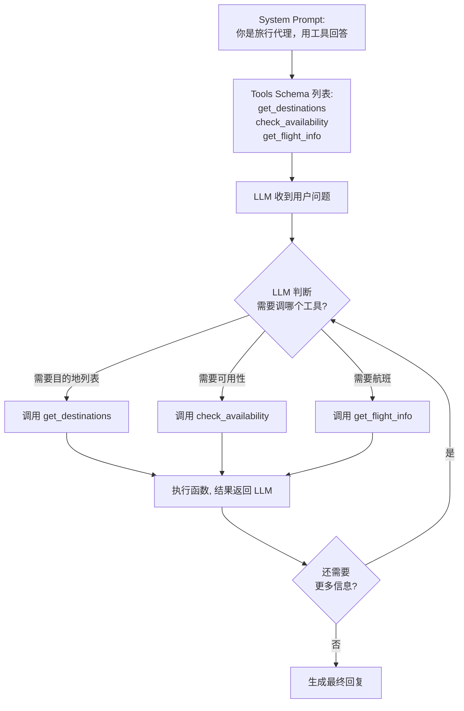
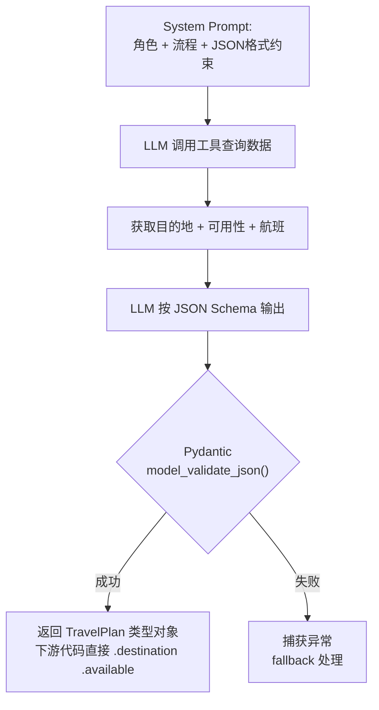
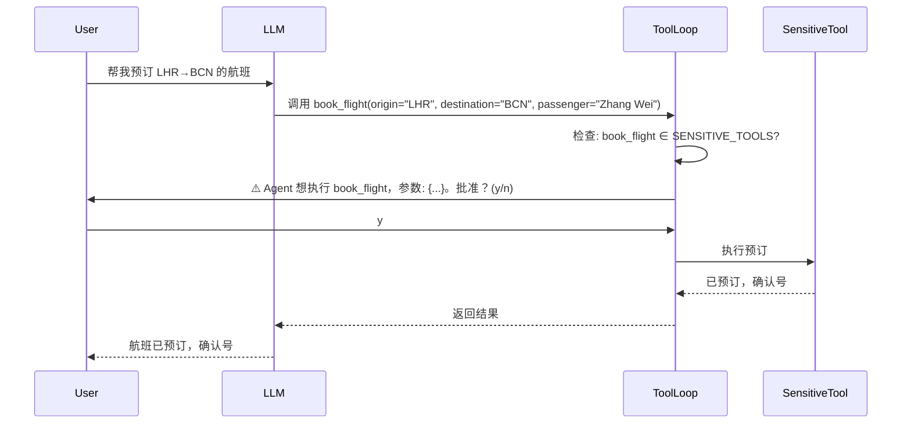
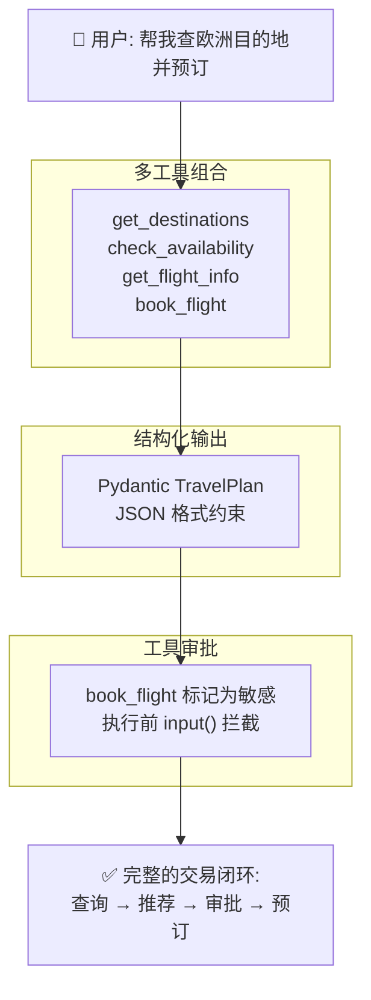

前面三篇文章分别讲了 Agent 的本质（tool calling 循环）、框架的四层抽象、以及三种 Agentic 设计模式。这些解决了"Agent 是什么"和"怎么设计一个 Agent"的问题。

但 Agent 的能力边界由工具决定。一个只有查询工具的 Agent 只能回答问题，一个有预订工具的 Agent 才能完成交易。

本文以"旅行预订代理"为场景，讲解三种工具使用设计模式。

---

📦 **相关链接**

- 项目仓库：[Building Agent from Scratch](https://github.com/chenzhao-labs/Building_Agent_from_scratch)
- 本课代码：[04-tool-use/code_samples/](https://github.com/chenzhao-labs/Building_Agent_from_scratch/tree/main/04-tool-use/code_samples)
- 原生 SDK 版：[04-python-agent-framework.py](https://github.com/chenzhao-labs/Building_Agent_from_scratch/blob/main/04-tool-use/code_samples/04-python-agent-framework.py)
- qwen-agent 框架版：[04-qwen-agent-framework.py](https://github.com/chenzhao-labs/Building_Agent_from_scratch/blob/main/04-tool-use/code_samples/04-qwen-agent-framework.py)

---

## 🎯 三种模式解决什么问题



---

## 模式 1：多工具组合

### 问题

前面的课程里，Agent 只有一个工具。现实中的 Agent 通常同时持有多个工具——查询目的地、检查可用性、查航班信息、预订机票。

当工具数量从 1 变成 3+，核心问题变了：**LLM 如何决定先调哪个、后调哪个、传什么参数？**

### 解法：把所有工具的 Schema 一次性传给 LLM

不做路由，不做编排。把所有工具的 JSON Schema 放进一个列表，一次性传给 LLM。LLM 自己判断该调谁。



这个流程就是 tool calling 循环的完整版。和单工具版本的区别只有一个：**TOOLS_SCHEMA 列表里有多个元素**。

### 工具定义方式

在原生 SDK 中，每个工具由两部分组成：JSON Schema（描述工具签名）+ Python 函数（实现逻辑）。以 `check_availability` 为例：

| 组成部分 | 内容 |
|---------|------|
| **JSON Schema** | `name: "check_availability"`, `parameters: {destination: string}` |
| **Python 函数** | `check_availability(destination)` → 查字典返回可用性 |

三个工具分别定义后，统一放入 `TOOLS_SCHEMA` 列表和 `TOOL_MAP` 字典。LLM 通过 Schema 知道"有什么工具"，通过 tool calling 返回的函数名找到对应实现。

在 qwen-agent 中，用 `@register_tool` 装饰器注册工具类，`Assistant(function_list=[...])` 传入工具名列表。框架内部自动完成 Schema 生成和 tool calling 循环。

### 核心洞察

多工具组合不需要"编排引擎"。LLM 本身就是编排器——你把工具描述给它，它自己决定调用顺序。你的代码只需要做两件事：

1. 把工具 Schema 传给 LLM
2. 根据 LLM 返回的函数名执行对应函数，把结果传回去

这就是 tool calling 循环的全部秘密。

---

## 模式 2：结构化输出

### 问题

自由文本适合人读，不适合代码消费。如果 Agent 输出了"建议预订巴塞罗那，价格 350 美元，航班 BA 2042"，下游自动预订系统需要从这句话里提取目的地、价格、航班号——这就是正则噩梦。

### 解法：Pydantic 模型 + JSON 约束

定义 Pydantic 模型作为输出契约，在 system prompt 中指定 JSON 格式，最后用 `model_validate_json()` 验证。

**输出契约定义：**

| 模型 | 字段 | 类型 | 说明 |
|------|------|------|------|
| **BookingRecommendation** | destination | str | 目的地名称 |
| | available | bool | 是否可预订 |
| | flight_details | str | 航班详情 |
| | estimated_cost | int | 预估费用（美元） |
| **TravelPlan** | recommendations | list[BookingRecommendation] | 推荐列表 |

**System prompt 中的格式约束：**

> 最终回复必须是严格的 JSON。格式示例：
> `{"recommendations": [{"destination": "巴塞罗那", "available": true, "flight_details": "BA 2042, 08:30-11:45", "estimated_cost": 350}]}`
> 不要包含 markdown 代码块标记。

### 完整数据流



### 为什么把格式写在 prompt 里而不是用框架参数

qwen-agent 的 `Assistant` 没有 `response_format` 参数。MAF 和 LangChain 有，但每个框架的 API 不同。把格式要求写在 prompt 里：

- 你完全控制输出格式的细粒度
- 换框架不需要改 prompt
- Pydantic 做最后一道验证，格式偏差能被立刻发现

### 和 Lesson 03 结构化输出的区别

Lesson 03 的结构化输出是"纯推理型"——Agent 没有工具，LLM 基于训练数据直接生成 JSON。本课的结构化输出是"工具增强型"——**LLM 先调工具获取真实数据，再基于数据生成结构化 JSON**。后者的输出不是"编"出来的，是有数据支撑的。

---

## 模式 3：工具审批模式

### 问题

查询类操作可以自动执行，但副作用操作（预订、扣款、发送）不行。你不想让 Agent 不经确认就花掉用户的钱。

### 解法：敏感工具执行前拦截



如果用户输入 `n`，工具不会被真正执行，LLM 收到的是"操作被用户拒绝"的提示，它会据此调整回复。

### 两种实现方式

| 实现位置 | 原生 SDK | qwen-agent |
|---------|----------|------------|
| **拦截点** | tool calling 循环中，执行前检查 `SENSITIVE_TOOLS` 集合 | `BaseTool.call()` 方法内部，`input()` 询问 |
| **敏感标记** | 全局 `SENSITIVE_TOOLS = {"book_flight"}` 集合 | 无独立标记，工具自身决定是否询问 |
| **审批交互** | `input("是否批准执行？(y/n): ")` | 同左，`input()` 停住进程等待输入 |

两种方式本质一样：**在函数真正执行前，用 `input()` 停住进程，等人工确认**。

### 框架没有内置审批的原因

MAF 有 `approval_mode` 参数，qwen-agent 没有。这不是框架的缺陷——审批逻辑本质是业务逻辑，和工具参数、用户权限、风控策略强耦合。框架很难提供一个通用参数覆盖所有场景。自己写 `input()` 拦截反而最灵活。

---

## 💡 三种模式怎么组合

三个模式叠加在同一个旅行预订 Agent 上：



一个完整的交易型 Agent 需要三个模式同时生效：
- **多工具组合**让 Agent 有能力完成复杂查询
- **结构化输出**让查询结果能被下游系统可靠消费
- **工具审批**让副作用操作不越权

---

## 🔑 框架对比速查

| 概念 | 原生 SDK | qwen-agent |
|------|----------|------------|
| 工具定义 | JSON Schema + Python 函数，手动维护一致性 | `@register_tool` + `BaseTool` 子类，参数格式为字典列表 |
| 多工具组合 | 全部放入 `TOOLS_SCHEMA` 列表 | `function_list=["tool1", "tool2", ...]` |
| 工具参数格式 | JSON Schema 标准 `properties` + `required` | `parameters` 列表：`[{"name": ..., "type": ..., "required": ...}]` |
| 结构化输出 | system_message 中指定 JSON + Pydantic 验证 | 同左（框架无 `response_format`） |
| 审批模式 | tool calling 循环中检查 `SENSITIVE_TOOLS` 集合 | `BaseTool.call()` 内部 `input()` 拦截 |
| tool calling 循环 | `while True` 手动管理 | `Assistant.run()` 内部自动完成 |

---

## 🚀 运行

```bash
cd 04-tool-use/code_samples

# 原生版（包含多工具 + 结构化输出，审批模式默认跳过）
python 04-python-agent-framework.py

# 框架版（同样的三个示例）
python 04-qwen-agent-framework.py

# 要体验工具审批模式，编辑代码取消注释 demo_3_approval_mode()
```

---

## 🔮 下一篇

有了工具使用的基础模式，下一篇进入 **Agentic RAG**——当 Agent 需要检索外部知识时，如何设计检索策略？单一向量检索够不够？怎么让 Agent 自己决定什么时候检索、检索什么？

---

## ✍️ 结语

三种工具使用模式的核心思想：

- **多工具组合**：不给 LLM 预设调用路径，让它自己根据工具描述决定调用顺序
- **结构化输出**：不让下游猜格式，用 Pydantic 做数据契约，让 JSON 成为 Agent 和系统之间的接口语言
- **工具审批**：副作用操作不是不能做，而是不能自动做——一行 `input()` 就是最灵活的安全阀

工具是 Agent 的手。学会设计工具，Agent 才从"能聊天"变成"能办事"。
